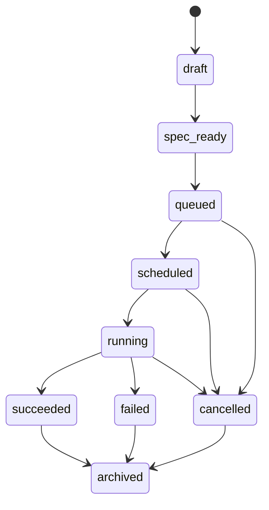
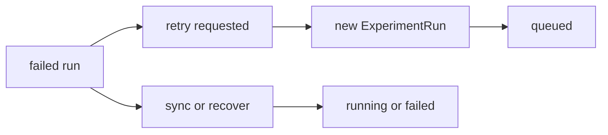
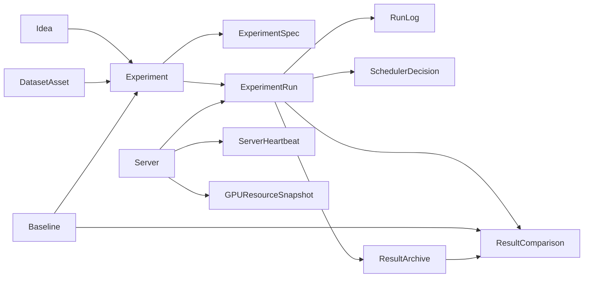

# 实验生命周期说明

## 1. 文档目标

本文定义阶段2实验生命周期、状态流转规则、恢复原则与对象关系摘要。

## 2. 生命周期总览

阶段2实验主生命周期状态为：

- `draft`
- `spec_ready`
- `queued`
- `scheduled`
- `running`
- `succeeded`
- `failed`
- `cancelled`
- `archived`

## 3. 状态定义

### 3.1 draft

含义：

- 实验对象已创建
- 但实验 spec 尚未冻结

允许动作：

- 编辑实验元信息
- 绑定或调整 `Idea / DatasetAsset / Baseline`
- 生成或重新生成 spec

### 3.2 spec_ready

含义：

- 已生成 `ExperimentSpec`
- spec 已通过基础校验
- 可以进入调度队列

允许动作：

- 提交进入队列
- 重新生成 spec 回到同状态
- 回退为 `draft`

### 3.3 queued

含义：

- 实验已请求执行
- 正在等待可用 server / GPU 资源

允许动作：

- 调度
- 取消

### 3.4 scheduled

含义：

- 已完成调度决策
- 已选中目标 server 与资源
- 即将启动实际 run

允许动作：

- 启动 run
- 取消
- 重新调度

### 3.5 running

含义：

- 远程任务已开始执行
- 日志、状态、错误、产物开始产生

允许动作：

- 同步状态
- 取消
- 标记失败
- 标记成功

### 3.6 succeeded

含义：

- 运行成功完成
- 可进行结果沉淀与结果比较

允许动作：

- 生成 `ResultArchive`
- 生成 `ResultComparison`
- 归档

### 3.7 failed

含义：

- 运行失败
- 需要保留错误信息、调度信息、日志和 spec

允许动作：

- 查看失败原因
- 发起重试
- 发起恢复
- 归档

### 3.8 cancelled

含义：

- 实验或 run 被用户或系统取消

允许动作：

- 查看取消原因
- 归档
- 可选重新提交生成新 run

### 3.9 archived

含义：

- 实验生命周期结束，转入历史态

允许动作：

- 查看

不允许动作：

- 不再重新排队当前对象

## 4. 推荐状态流转

主流转：

重试与恢复流转：

## 5. Experiment 与 ExperimentRun 的关系

### 5.1 Experiment

- 表示实验定义与业务主状态
- 管理 spec、关联对象和最新 run

### 5.2 ExperimentRun

- 表示一次实际执行
- 管理调度、日志、错误与结果

原则：

- 一个 `Experiment` 可有多个 `ExperimentRun`
- 生命周期主状态以 `Experiment` 为业务视图
- `ExperimentRun` 承担真实执行细节

## 6. 生命周期与已有对象的关系

### 6.1 与 Idea 的关系

- `Idea` 提供研究动机
- `Experiment` 可选绑定一个 `Idea`

### 6.2 与 DatasetAsset 的关系

- `DatasetAsset` 是实验输入数据语义主对象
- 每个 `Experiment` 必须绑定一个 `DatasetAsset`

### 6.3 与 Baseline 的关系

- `Baseline` 是实验默认比较参照
- `Experiment` 可选绑定一个主 baseline

### 6.4 与 ResultArchive 的关系

- `ResultArchive` 不是生命周期对象
- 它是实验完成后的归档对象

关系规则：

- `succeeded` 后可生成或更新 `ResultArchive`
- `failed` 不强制生成 `ResultArchive`

## 7. 调度与资源对象在生命周期中的位置

### 7.1 SchedulerDecision

产生时机：

- `queued -> scheduled`

作用：

- 记录选择了哪台 server
- 记录选择依据和候选快照

### 7.2 ServerHeartbeat

产生时机：

- 定时探测
- 调度前探测
- 手动资源刷新

作用：

- 判断 server 是否可参与调度

### 7.3 GPUResourceSnapshot

产生时机：

- 定时探测
- 调度前探测
- 调度后可选复核

作用：

- 作为调度输入
- 作为失败分析证据

## 8. 日志与事件

阶段2建议把日志分为两类：

### 8.1 事件日志

例如：

- spec generated
- queued
- scheduled
- run started
- run finished
- run failed

### 8.2 输出日志

例如：

- stdout 摘要
- stderr 摘要
- 关键错误片段

最小策略：

- 不强求完整实时流式终端
- 先保证关键事件和错误摘要可见

## 9. 恢复与重试语义

### 9.1 恢复

恢复适用于：

- 本地状态未知
- 远程任务可能仍在运行
- 需要重新同步状态

恢复动作：

- 查询远程状态
- 同步本地 run 状态
- 继续 `running`
- 或落到 `failed`

### 9.2 重试

重试适用于：

- 上一个 run 已明确失败
- 需要在同一实验定义下重新执行

重试规则：

- 必须生成新的 `ExperimentRun`
- 原 run 日志和错误不可覆盖

## 10. 归档语义

### 10.1 实验归档

- 表示该实验对象不再参与新的生命周期推进

### 10.2 结果归档

- 表示成功 run 的结果沉淀为长期资产

两者区别：

- `Experiment.archived` 是执行对象结束
- `ResultArchive` 是科研结果资产沉淀

## 11. 生命周期摘要

最小摘要如下：

- `draft`：定义实验
- `spec_ready`：冻结 spec
- `queued`：等待资源
- `scheduled`：已选中 server
- `running`：正在执行
- `succeeded`：执行成功，可归档和对比
- `failed`：执行失败，可恢复或重试
- `cancelled`：执行取消
- `archived`：生命周期结束

## 12. 对象关系摘要

最小对象关系如下：

