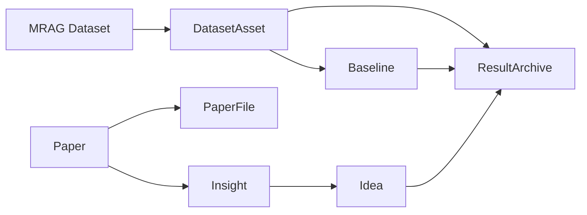

# 阶段1科研资产对象模型

## 1. 文档目的

本文档定义阶段1科研资产管理系统中的核心对象、关键字段建议、对象关系与约束，用于后续数据库设计、API 设计和前端页面设计对齐。

本文档中的对象是规格对象，不代表当前代码已经实现。

## 2. 对象清单

阶段1核心对象如下：

- `Paper`
- `PaperFile`
- `Insight`
- `Idea`
- `DatasetAsset`
- `Baseline`
- `ResultArchive`

辅助对象可在实现阶段增加，例如：

- `PaperParseRecord`
- `ResearchArtifact`

## 3. 对象定义

### 3.1 Paper

定义：

- 表示一篇被系统导入并管理的论文对象。

建议关键字段：

- `id`
- `source_type`
- `source_uri`
- `title`
- `abstract`
- `authors`
- `published_at`
- `venue`
- `tags_json`
- `parse_status`
- `primary_file_id`
- `created_at`
- `updated_at`

说明：

- `Paper` 是论文的逻辑主对象。
- 原始文件、解析中间文件、附件不直接塞入 `Paper` 本体，而由 `PaperFile` 承担。

### 3.2 PaperFile

定义：

- 表示与某篇论文关联的文件对象。

建议关键字段：

- `id`
- `paper_id`
- `file_role`
- `file_name`
- `mime_type`
- `storage_path`
- `checksum`
- `size_bytes`
- `metadata_json`
- `created_at`

`file_role` 建议值：

- `original`
- `parsed_text`
- `summary`
- `attachment`

说明：

- 一篇论文可以有多个文件。
- 阶段1中，至少支持原始导入文件与解析产物文件。

### 3.3 Insight

定义：

- 表示从论文解析结果中抽取出的结构化创新点、洞察、方法点或问题点。

建议关键字段：

- `id`
- `paper_id`
- `insight_type`
- `title`
- `content`
- `confidence`
- `source_span`
- `metadata_json`
- `created_by`
- `created_at`
- `updated_at`

`insight_type` 建议值：

- `contribution`
- `method`
- `finding`
- `limitation`
- `opportunity`

说明：

- 一个 `Paper` 可以有多个 `Insight`。
- `Insight` 可以由解析脚本生成，也可以由人工补充。

### 3.4 Idea

定义：

- 表示基于论文洞察、研究问题或人工输入形成的研究想法对象。

建议关键字段：

- `id`
- `title`
- `description`
- `status`
- `source_type`
- `rationale_json`
- `owner_note`
- `created_at`
- `updated_at`

`status` 建议值：

- `draft`
- `candidate`
- `validated`
- `archived`

`source_type` 建议值：

- `from_insight`
- `manual`
- `hybrid`

关系补充：

- `Idea` 与 `Insight` 建议通过关系表关联，例如 `idea_insights`。
- 这样一个 idea 可以引用多个 insights，一个 insight 也可以支持多个 ideas。

### 3.5 DatasetAsset

定义：

- 表示科研资产层的数据集对象。
- 它建立在 MRAG 现有 `Dataset` 记录之上，用于承载研究语义，而不是替代现有数据集扫描对象。

建议关键字段：

- `id`
- `dataset_id`
- `asset_name`
- `research_description`
- `task_type`
- `recommended_usage`
- `status`
- `owner_note`
- `metadata_json`
- `created_at`
- `updated_at`

关键约束：

- `dataset_id` 必须引用 MRAG 已存在的 `datasets.id`。
- 一个 MRAG `Dataset` 建议最多对应一个主 `DatasetAsset`，避免资产语义重复。

说明：

- MRAG `Dataset` 负责扫描、校验、预览、索引。
- `DatasetAsset` 负责科研资产管理语义、baseline 关联、结果归档关联。

### 3.6 Baseline

定义：

- 表示某个科研数据集资产上的已知基线方法与指标记录。

建议关键字段：

- `id`
- `dataset_asset_id`
- `name`
- `description`
- `method_type`
- `metrics_json`
- `summary_path`
- `artifact_path`
- `created_at`
- `updated_at`

说明：

- 一个 `DatasetAsset` 可以有多个 `Baseline`。
- `Baseline` 是资产记录，不代表系统自动跑过该 baseline。
- 阶段1只要求支持登记和查看，不要求自动执行。

### 3.7 ResultArchive

定义：

- 表示一个已发生结果的归档记录。
- 它用于存储结果说明、指标、附件与关联关系，不代表系统拥有实验自动化能力。

建议关键字段：

- `id`
- `title`
- `summary`
- `conclusion`
- `metrics_json`
- `source_note`
- `dataset_asset_id`
- `baseline_id`
- `idea_id`
- `server_id`
- `archive_path`
- `artifact_manifest_json`
- `created_at`
- `updated_at`

说明：

- `dataset_asset_id` 必填。
- `baseline_id` 可选。
- `idea_id` 可选。
- `server_id` 可选，仅表示结果来源相关服务器，不触发调度语义。

## 4. 对象关系

### 4.1 主关系

- 一个 `Paper` 对多个 `PaperFile`
- 一个 `Paper` 对多个 `Insight`
- 多个 `Insight` 对多个 `Idea`
- 一个 MRAG `Dataset` 对零个或一个 `DatasetAsset`
- 一个 `DatasetAsset` 对多个 `Baseline`
- 一个 `DatasetAsset` 对多个 `ResultArchive`
- 一个 `Baseline` 对多个 `ResultArchive`
- 一个 `Idea` 对多个 `ResultArchive`

### 4.2 关系图

### 4.3 关系约束

- `DatasetAsset` 必须依附于 MRAG 已存在 `Dataset`。
- `ResultArchive` 必须关联一个 `DatasetAsset`。
- `ResultArchive` 不直接依赖 `Experiment` 对象。
- 阶段1中不存在必须实现的 `Experiment` 主对象。
- `PaperFile` 必须依附于 `Paper`。
- `Insight` 必须依附于 `Paper`。

## 5. 对象生命周期摘要

### 5.1 Paper 生命周期

- 导入
- 挂载原始文件
- 解析
- 产生 insights
- 持续被引用

### 5.2 Idea 生命周期

- 从 insight 生成或人工创建
- 进入 idea 池
- 被标记状态
- 可被归档结果引用

### 5.3 DatasetAsset 生命周期

- 来自 MRAG 现有 dataset
- 注册为科研资产
- 维护 baseline
- 被结果归档引用

### 5.4 ResultArchive 生命周期

- 人工创建或导入已有结果
- 挂接 DatasetAsset / Baseline / Idea
- 填写指标、摘要、结论
- 作为可检索历史记录长期存在

## 6. DatasetAsset 与 MRAG Dataset 的建模要求

阶段1必须坚持以下建模约束：

- 不复制 MRAG `Dataset` 的扫描字段到 `DatasetAsset` 作为新的真源。
- `DatasetAsset` 应通过外键关联 MRAG `Dataset`。
- 前端展示 `DatasetAsset` 时，应能看到其背后的 MRAG 数据集基础信息，例如名称、路径、扫描状态、规模摘要。
- 数据集扫描与路径校验继续走 MRAG 现有链路。

## 7. ResultArchive 的建模要求

阶段1必须坚持以下建模约束：

- `ResultArchive` 是归档对象，不是执行对象。
- 不为 `ResultArchive` 增加“待调度、运行中、已完成”这类实验状态机语义作为主流程。
- 允许 `ResultArchive` 保存外部实验、手动实验、离线评测结果。
- 允许 `ResultArchive` 仅记录结论和附件，而不要求存在自动生成的实验 spec。

## 8. 最小实现建议

如果阶段1需要保持最小侵入，建议优先实现：

- `Paper`
- `PaperFile`
- `Insight`
- `Idea`
- `DatasetAsset`
- `Baseline`
- `ResultArchive`

以下对象可后置：

- `PaperParseRecord`
- `ResearchArtifact`
- 更细粒度的多对多关系附加属性表
